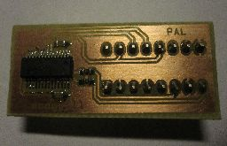

# 8701 replacement for C64.

This is a replacement 8701 chip for the Commodore 64 by using the ICS525-01
clock generator chip.

The chip configuration is based on the
[https://www.youtube.com/watch?v=ipQD7fEKG38](youtube comments by @iz8dwf)

This configuration is currently only for PAL C64's.
